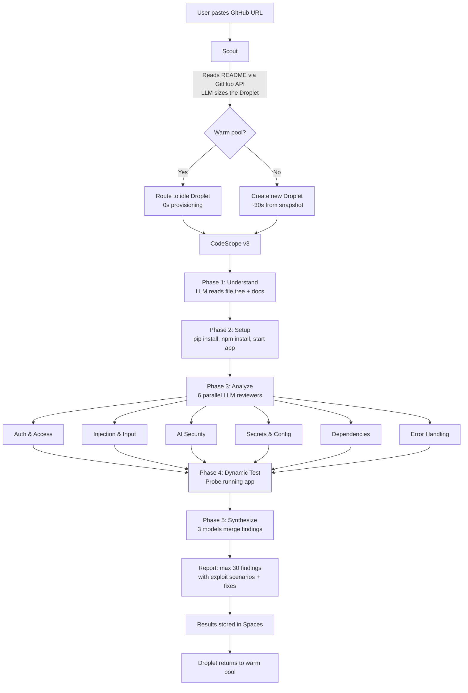

# CodeScope

LLM-first security auditing. Paste a GitHub repo, get real vulnerabilities with exploit scenarios and code fixes.

**Live**: [codescope.ephemeral.ai](https://ephemeral-ai.sfo3.digitaloceanspaces.com/dashboard/index.html) | **API**: [docs](https://ephemeral-ai-dgdbw.ondigitalocean.app/docs)

---

## What it does

You paste a GitHub URL. CodeScope clones the repo into an ephemeral VM, installs it, tries to run it, and has 6 parallel LLM security reviewers analyze the code. Findings come with exploit scenarios and code fixes. The VM is recycled after every scan.

No regex. No pattern matching. The LLM reads your actual code and understands it.

## How it works



## Quick start

### Prerequisites

- Python 3.11+
- A [DigitalOcean account](https://cloud.digitalocean.com) with:
  - API token
  - Spaces bucket + access keys
  - Gradient AI model access key

### Setup

```bash
git clone https://github.com/chopratejas/ephemeral-ai
cd ephemeral-ai
pip install -r requirements.txt
cp .env.example .env
```

Edit `.env` with your keys:

```env
DIGITALOCEAN_API_TOKEN=dop_v1_...
SPACES_KEY=DO...
SPACES_SECRET=...
SPACES_BUCKET=ephemeral-ai
SPACES_REGION=sfo3
GRADIENT_MODEL_ACCESS_KEY=dg_...
ORCHESTRATOR_URL=http://localhost:8000
```

### Run

```bash
uvicorn orchestrator.main:app --port 8000
```

### Submit an audit

```bash
curl -X POST http://localhost:8000/api/v1/audit \
  -H "Content-Type: application/json" \
  -d '{"repo_url": "https://github.com/expressjs/cors"}'
```

Poll for results:

```bash
curl http://localhost:8000/api/v1/tasks/{task_id}
```

### Dashboard

```bash
cd dashboard
npm install
npm run dev
```

Open `http://localhost:5173`. Paste a repo URL. Watch it scan.

## API

| Endpoint | Method | Description |
|----------|--------|-------------|
| `/api/v1/audit` | POST | Submit a security audit |
| `/api/v1/tasks/{id}` | GET | Get task status and results |
| `/api/v1/tasks/{id}/report` | GET | Get parsed findings + report |
| `/api/v1/findings/fix` | POST | Apply a fix on the Droplet |
| `/api/v1/findings/create-pr` | POST | Create a GitHub PR from a fix |
| `/api/v1/audits/recent` | GET | Global audit feed |
| `/api/v1/stats` | GET | Platform statistics |
| `/health` | GET | Health check + warm pool status |

## Architecture

```
orchestrator/
├── main.py              # FastAPI API (18 routes)
├── codescope.py         # v3 audit engine (LLM-first, 5 phases)
├── worker_daemon.py     # Long-lived Droplet daemon
├── scout.py             # Pre-audit repo sizing
├── warm_pool.py         # Droplet reuse within billing hour
├── task_router.py       # Route to warm or new Droplets
├── droplet_manager.py   # DigitalOcean Droplet lifecycle
├── spaces.py            # DigitalOcean Spaces storage
├── audit_store.py       # Persist audit history
├── cloud_init.py        # Droplet bootstrap script
├── neural_gateway.py    # Gradient AI integration
├── config.py            # Environment config
├── models.py            # Data models
├── security.py          # Rate limiting + budget
├── cost_tracker.py      # Cost calculation
├── pipeline.py          # Multi-step pipelines (future)
└── websocket.py         # Real-time events

dashboard/
└── src/
    ├── App.tsx           # React app
    ├── api.ts            # Backend client
    └── components/       # UI components
```

## DigitalOcean services used

| Service | Purpose |
|---------|---------|
| Gradient AI | LLM security analysis (3 models in parallel) |
| Droplets | Ephemeral audit VMs with warm pool reuse |
| Spaces | Result storage, dashboard hosting, audit history |
| App Platform | API hosting via Container Registry |
| Snapshots | Pre-built images for fast Droplet boot |

## Environment variables

| Variable | Required | Description |
|----------|----------|-------------|
| `DIGITALOCEAN_API_TOKEN` | Yes | DO API token for Droplet management |
| `SPACES_KEY` | Yes | Spaces access key |
| `SPACES_SECRET` | Yes | Spaces secret key |
| `SPACES_BUCKET` | Yes | Spaces bucket name |
| `SPACES_REGION` | Yes | Spaces region (e.g. `sfo3`) |
| `GRADIENT_MODEL_ACCESS_KEY` | Yes | Gradient AI model key |
| `ORCHESTRATOR_URL` | Yes | Public URL of the orchestrator |
| `MAX_CONCURRENT_DROPLETS` | No | Max Droplets (default: 5) |
| `MAX_DROPLET_AGE_MINUTES` | No | Droplet lifetime (default: 55) |
| `DAILY_BUDGET_USD` | No | Daily spend cap (default: 5.0) |

## License

MIT
